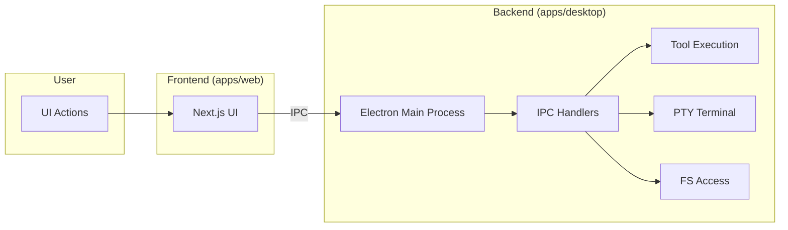

# Titan AI Full Project Overview

This document is an exhaustive, structured description of how Titan AI works end-to-end: UI, APIs, background systems, data flows, and what is fully working today versus simulated or mock integrations.

---

## 1. System Overview and Key Flows

Titan AI is an AI-native IDE delivered as a Next.js web application. The main entry is a single-page IDE (`TitanIDE`) that composes a title bar, activity bar, resizable sidebar with multiple panel views, a Monaco-based code editor, an optional terminal panel, and a status bar. AI chat is integrated into the sidebar with session history and diff-based code suggestions. Project Midnight is an autonomous build/verify system exposed via a status-bar toggle and a full-screen Factory View dashboard.

**End-to-end flow (high level):**

- **User → UI:** The user interacts with the Next.js web application running inside an Electron window.
- **UI → Backend:** The frontend UI, built with Next.js and React, communicates with the Electron backend via Inter-Process Communication (IPC) calls. These are asynchronous messages sent from the renderer process (web content) to the main process (Node.js environment).
- **Backend → Services:** The Electron main process (`apps/desktop/src/main.ts`) is the core of the application. It listens for IPC messages and routes them to various handlers responsible for specific tasks:
    - **Tool Execution (`ipc/tools.js`):** Executes agentic tools like `run_command`.
    - **Terminal (`ipc/terminal.js`):** Manages pseudo-terminal (PTY) sessions.
    - **Filesystem (`ipc/filesystem.js`):** Handles file reading, writing, and directory listing.
    - **Git (`ipc/git.js`):** Executes Git commands.
    - **And others...** This modular architecture allows for extending the AI's capabilities by adding new IPC handlers.
- **Autonomous Operation:** The "Midnight" autonomous functionality is not a separate package but is integrated into the Electron main process. Agent loops and orchestration are managed within the main process, leveraging the same IPC handlers that the user-facing UI uses.

---

## 2. UI Features and Interactions

All UI below is implemented in [apps/web/src/app/page.tsx](apps/web/src/app/page.tsx) unless noted.

### 2.1 Title Bar (35px)

- **Hamburger:** Toggles sidebar (same as Ctrl+B); opens Titan Agent view if closed.
- **Logo:** "Titan AI" text.
- **Menus:** File, Edit, Selection, View, Go, Run, Terminal, Help. Each opens a dropdown with items and shortcuts.
  - **File:** New File (Ctrl+N), New Window, Open File, Open Folder (calls `/api/workspace` with `action: 'import'`), Save (Ctrl+S), Save All.
  - **Edit:** Undo, Redo, Cut, Copy, Paste, Find, Replace (all delegate to Monaco when editor is focused).
  - **Selection:** Select All, Expand Selection.
  - **View:** Command Palette (Ctrl+Shift+P), Explorer (Ctrl+Shift+E), Search (Ctrl+Shift+F), Source Control (Ctrl+Shift+G), Run and Debug, Toggle Sidebar, Toggle Terminal.
  - **Go:** Go to File, Go to Symbol, Go to Line.
  - **Run:** Start/Stop Debugging (F5, Shift+F5).
  - **Terminal:** New Terminal (Ctrl+`), Split Terminal.
  - **Help:** Documentation, Report Issue, About.
- **Tab bar:** "+" dropdown (New File, New Terminal, New Agent Session); file tabs with icon, name, modified dot, close button. Active tab drives Monaco content.
- **Model pill (top-right):** Opens searchable, tiered dropdown (Frontier, Standard, Economy, Local). Data from `GET /api/models`. Selecting a model sets `activeModel` globally (chat and Midnight use it).

### 2.2 Activity Bar (48px, left)

Eight icons; clicking toggles the left sidebar and switches `activeView`:

| Icon        | View ID       | Panel Content |
|------------|---------------|----------------|
| Explorer   | `explorer`    | ExplorerPanel |
| Search     | `search`      | SearchPanel   |
| Source Control | `git`     | GitPanel      |
| Run/Debug  | `debug`       | DebugPanel    |
| Extensions | `extensions`  | ExtensionsPanel |
| Titan Agent| `titan-agent` | TitanAgentPanel |
| Accounts   | `accounts`    | AccountsPanel |
| Settings   | `settings`    | SettingsPanel |

Active icon is highlighted with a vertical accent bar.

### 2.3 Left Sidebar (320px)

Rendered only when `activeView` is set. One panel at a time.

- **ExplorerPanel**
  - **Open Editors:** Collapsible list of open tabs; click to switch file, optional close per tab.
  - **Folder tree (TITAN AI):** Collapsible list of files from `fileContents` (keys from `FILE_CONTENTS` plus any created). Click opens file in editor; right-click context menu: Open File, Add/Remove from AI Context, Copy Path, Rename, Delete.
  - **AI Context:** Section listing files added to context (with remove).
- **SearchPanel:** Search and replace inputs; Search / Replace / Replace All; results list with file:line and snippet; click jumps to file and line in Monaco.
- **GitPanel:** Branch dropdown; commit message textarea; Commit button; Staged and Changes lists with stage/unstage. Commit appends simulated git output to terminal.
- **DebugPanel:** Configuration dropdown; Start/Stop Debugging; Variables, Watch, Call Stack placeholders. Start/Stop trigger terminal messages.
- **ExtensionsPanel:** Search input; list of "Installed" extensions (TypeScript, ESLint, Prettier) as placeholders.
- **TitanAgentPanel**
  - **New Agent:** `POST /api/sessions` with name and current `activeModel`; new UUID session prepended and selected; context cleared for that session.
  - **Session list:** Vertical list of recent sessions (up to 5); click to switch `activeSessionId`.
  - **Chat area:** Message history for current session; thinking indicator while request in flight.
  - **Diff banner:** When `pendingDiff` is set, shows "Diff Preview Active" with Reject and Accept. Accept applies diff to Monaco and clears pending diff; Reject restores original and clears diff.
  - **Changed files:** Collapsible list and Apply button when session has `changedFiles` (from AI suggested edits).
  - **Chat input:** Textarea (Enter to send); shows current `activeModel`; send calls `handleSend` (see below).
- **AccountsPanel:** User avatar and email; "API Keys (BYOK)" section with providers (OpenAI, Anthropic, Google, OpenRouter, DeepSeek, Mistral); per-provider "Add Key" / Connected state and masked key; "Usage This Month" with credits and progress bar. Add Key is local state only (no API).
- **SettingsPanel:** Search; Editor (font size, tab size, word wrap); Titan AI default model dropdown (uses same `models` fallback list); Project Midnight section with TrustSlider (1–3). All settings are React state and persisted via localStorage.

### 2.4 Center: Breadcrumb, Editor, Terminal

- **Breadcrumb:** Shows active file path and Ln/Col, language, encoding.
- **Monaco Editor**
  - Language and value from `fileContents[activeTab]` and `FILE_CONTENTS` metadata.
  - `onChange` updates `fileContents` and marks tab modified.
  - `onMount`: stores editor and monaco instances; cursor position → `cursorPosition`; custom theme `titan-dark` with error/warning/info colors set to transparent; TypeScript/JavaScript diagnostics disabled; diff-related CSS classes injected for decorations.
  - **Live Vision:** `handleSend` reads `editorInstance.getValue()`, `getSelection()`, and `getValueInRange(selection)` and sends them as `codeContext` to `/api/chat`.
  - **Diff decorations:** When the chat API returns `suggestedEdits` with `content`, or when the reply contains a code block, `applyDiffDecorations` runs: it computes line-based diff, applies green "added" line decorations via `deltaDecorations`, sets the model value to the new content, and stores `pendingDiff` (file, oldContent, newContent, decorationIds). Accept applies new content to state and clears decorations; Reject restores `oldContent` and clears decorations.
- **Terminal (optional, 200px):** Toggle via View menu or Ctrl+`. Output lines in state; input line with Enter handler that appends command and simulates responses (e.g. ls, pwd, cd, npm run dev, git status, clear, help). Close button hides panel.

### 2.5 Right Panel (260px)

Optional ExplorerPanel in "isRight" mode when `showRightPanel` is true and `activeView !== 'explorer'`. Same file list and open-in-editor behavior, no Open Editors section.

### 2.6 Status Bar (22px)

- Left: Git branch (click → Source Control), unsaved count.
- Right: MidnightToggle (crescent moon), ConfidenceIndicator (when Midnight active), language, Ln/Col, active model. Midnight toggle: if inactive, `POST /api/midnight` with `action: 'start'` and current `trustLevel`, then sets `midnightActive` and opens FactoryView; if active, just opens FactoryView.

### 2.7 Project Midnight Factory View (full-screen overlay)

Implemented in [apps/web/src/components/midnight/FactoryView.tsx](apps/web/src/components/midnight/FactoryView.tsx).

- **Header:** Moon icon, current project name, progress bar, ConfidenceMeter, Pause/Resume (calls `/api/midnight` pause/resume), Stop (calls stop, then `onStop` to clear `midnightActive`), Close (minimize; Midnight keeps running in API).
- **Content:** Two columns — Actor terminal (left) and Sentinel terminal (right). Log lines with type-based color (info, success, error, command, output). Polling every 2s: `GET /api/midnight` for status (confidence, currentProject, progress, tasksCompleted, queueLength, running); `POST /api/midnight` with `action: 'getLogs'` for actor/sentinel log arrays and last verdict. Uptime counter when open and running.
- **Queue sidebar:** "Add Project to Queue" (prompt for name/path, `POST /api/midnight` addToQueue); QueueList with drag-and-drop reorder (reorderQueue) and remove (removeFromQueue). Current task text at bottom.
- **Status bar:** Running/Paused/Stopped, trust level label, tasks completed/total, uptime.

[MidnightToggle](apps/web/src/components/midnight/MidnightToggle.tsx) is a crescent-moon button that calls `onToggle` from the status bar; it does not call the API itself.

[QueueList](apps/web/src/components/midnight/QueueList.tsx) renders the queue with status icons, progress bars, priority badge, and remove button; reorder and remove callbacks are wired to the main Midnight API in FactoryView.

### 2.8 Global Keyboard Shortcuts

- Ctrl+B: Toggle sidebar (Titan Agent).
- Ctrl+S: Save.
- Ctrl+N: New file.
- Ctrl+`: Toggle terminal.
- Ctrl+Shift+E / F / G: Explorer, Search, Source Control.
- Ctrl+Shift+P: Command palette (Monaco).
- Escape: Close model dropdown, plus dropdown, menus, and Factory View.

---

## 3. API Surface Area and Behaviors

All routes under [apps/web/src/app/api](apps/web/src/app/api).

### 3.1 GET /api/models

- **Behavior:** Returns static registry of 30+ models (Anthropic, OpenAI, Google, DeepSeek, Mistral, Cohere, Meta, xAI, MiniMax, Local).
- **Response:** `models`, `byProvider`, `total`, `providers`. Each model: id, name, provider, tier, contextWindow, maxOutputTokens, supportsThinking/Vision/Tools, costPer1MInput/Output, description.
- **Persistence:** None.
- **Integration:** Real static data; no external call.

### 3.2 POST /api/chat

- **Body:** sessionId, message, model, codeContext (file, content, selection, language), optional contextFiles.
- **Behavior:** Builds system prompt including code context; calls `simulateAIResponse` (500ms delay, pattern-based: explain, refactor, test, bug/fix, add/create/implement); returns content, usage, and optional `suggestedEdits` (file, content, range, oldContent, newContent).
- **Persistence:** None.
- **Integration:** Mock (production intent: LiteLLM/OpenRouter).

### 3.3 GET /api/sessions, POST /api/sessions, PATCH /api/sessions, DELETE /api/sessions

- **GET:** Optional `id`; with id returns that session; without id returns list (id, name, createdAt, updatedAt, messageCount, model).
- **POST:** Creates session with UUID, name, model; single welcome message; returns session.
- **PATCH:** Actions: addMessage, rename, setModel, addChangedFile, clearChangedFiles, addToContext, removeFromContext.
- **DELETE:** Query `id`; deletes session (default session protected).
- **Persistence:** In-memory `Map` (production intent: SQLite).

### 3.4 GET /api/midnight, POST /api/midnight

- **GET:** Returns full in-memory state: running, currentProject, queue, queueLength, confidenceScore, confidenceStatus, uptime, tasksCompleted/Failed/InProgress, trustLevel, startTime, actorLogs, sentinelLogs, lastVerdict, lastError.
- **POST body:** action (required). Actions:
  - **start:** Sets running, startTime, trustLevel, optional currentProject; seeds actor/sentinel logs; starts simulated execution loop (2s interval: append logs, fluctuate confidence, random Sentinel verdicts; on PASS, auto-handoff to next queued project; on FAIL, Redline revert message).
  - **stop:** Stops loop, clears currentProject, appends shutdown logs.
  - **pause / resume:** Stops/starts the loop; appends pause/resume logs.
  - **setTrustLevel:** Updates trustLevel 1–3.
  - **getLogs:** Returns last 50 actorLogs, sentinelLogs, lastVerdict.
  - **addToQueue:** name, path → new QueueProject appended; logs.
  - **removeFromQueue:** projectId → remove from queue, re-assign priorities.
  - **reorderQueue:** projectId, newIndex → reorder and re-assign priorities.
  - **getQueue:** Returns queue and currentProject.
- **Persistence:** In-memory object and interval (production intent: IPC to `@titan/midnight` daemon).

### 3.5 GET /api/workspace, POST /api/workspace

- **GET:** Returns workspace (path, name, indexed, indexing, indexProgress, fileCount, indexedFiles, lastIndexed, embeddings) and hasWorkspace.
- **POST body:** action, path. Actions: import (path required, starts simulated indexing), reindex, close, getIndexStatus. Indexing simulation: interval-based progress 0→100%, mock file list with symbols/tokens; on completion sets embeddings metadata.
- **Persistence:** In-memory (production intent: disk + Tree-sitter/LanceDB).

### 3.6 Other API Routes (brief)

- **/api/midnight/recover:** POST; stub recovery (snapshotId).
- **/api/midnight/snapshots:** GET (list, optional projectId), POST (create); mock array.
- **/api/midnight/stream:** GET; SSE stream with heartbeat and cycling mock events (actor_log, sentinel_log, verdict, confidence_update, task_completed).
- **/api/midnight/queue:** GET (list), POST (add), DELETE (remove), PATCH (reorder); separate mock array (not shared with main /api/midnight queue).
- **/api/mcp:** GET (list MCP servers), POST (JSON-RPC); mock MCP relay.
- **/api/indexing:** GET/POST; mock indexing/search (in-memory Map).
- **/api/gateway:** GET (models), POST (chat); mock gateway (production intent: LiteLLM/OpenRouter).

---

## 4. Project Midnight Architecture

### 4.1 Web Layer (apps/web)

- **Status bar:** MidnightToggle opens Factory View and starts Midnight via POST /api/midnight (start).
- **FactoryView:** Polls GET /api/midnight and POST getLogs; shows Actor/Sentinel logs, confidence, queue, current task; Pause/Resume/Stop and queue add/remove/reorder via POST /api/midnight. Queue state in FactoryView is local plus API reorder/remove; "Add Project" uses addToQueue. The main route’s queue is in-memory on the server; /api/midnight/queue uses a separate mock array.
- **Trust level:** Set in Settings and passed to start and displayed in Factory View.

### 4.2 In-Process Simulation (apps/web API route)

In [apps/web/src/app/api/midnight/route.ts](apps/web/src/app/api/midnight/route.ts):

- Single `midnightState` object and `executionInterval` (2s).
- Loop: append Actor log line; adjust confidenceScore; every ~20% chance emit Sentinel verdict (random pass/fail); if passed: increment tasksCompleted, run auto-handoff (mark current completed, pick next queued project as current, or clear current if none); if failed: increment tasksFailed, push revert message.
- start/stop/pause/resume/setTrustLevel/getLogs and queue CRUD all operate on this state. No SQLite or daemon in the Next.js app.

### 4.3 Package Layer (packages/midnight) — Backend Design

Used by a separate CLI/daemon (e.g. `titan --midnight`), not by the Next.js API today.

- **MidnightOrchestrator** ([packages/midnight/src/orchestration/midnight-orchestrator.ts](packages/midnight/src/orchestration/midnight-orchestrator.ts)): start/stop/pause; recovery check; main loop: get next project from queue, load DNA, run PocketFlow (loading → planning → building → verifying), AgentLoop per task, handoff on success; emits events; uses ProjectQueue, ProjectLoader, DurableStateEngine, AgentLoop, PocketFlowEngine, ProjectHandoff.
- **AgentLoop** ([packages/midnight/src/agents/agent-loop.ts](packages/midnight/src/agents/agent-loop.ts)): For each task: create worktree; Actor phase (execute with context); get git diff and repo map; Sentinel phase (veto check, verify, verdict); on PASS commit and continue; on FAIL revert worktree (if enabled), optionally lock task, retry with correction. Uses ActorAgent, SentinelAgent, WorktreeManager, RepoMapProvider.
- **ActorAgent / SentinelAgent:** Actor does code-run-fix loop with MCP tools; Sentinel does read-only verification and quality score (production: Claude Sonnet / Opus).
- **DurableStateEngine** ([packages/midnight/src/state/state-engine.ts](packages/midnight/src/state/state-engine.ts)): SQLite-backed snapshots (git hash, agent state), auto-snapshot interval, cooldown tracking, recovery.
- **ProjectQueue** ([packages/midnight/src/queue/project-queue.ts](packages/midnight/src/queue/project-queue.ts)): SQLite-backed queue (projects table, project_dna); add/remove/reorder, get next, update status, task management.
- **PocketFlowEngine:** State machine (idle, loading, research, planning, building, verifying, handoff, cooldown, error) with validated transitions.

So: the "real" Midnight (queue, state, orchestration, AgentLoop, Actor/Sentinel) is implemented in `packages/midnight` for a separate process; the web app talks only to the in-memory simulation in the Next.js API.

---

## 5. Persistence and State Recovery

### 5.1 Frontend (localStorage)

Key: `titan-ai-state`. Saved whenever relevant state changes (after mount): tabs (name, icon, color, modified), activeTab, sessions (id, name, time, messages, changedFiles), activeSessionId, activeModel, trustLevel, midnightActive, fileContents, gitBranch, fontSize, tabSize, wordWrap. Restored once on mount; restoration sets tabs, activeTab, sessions, activeSessionId, activeModel, trustLevel, midnightActive, fileContents, gitBranch, fontSize, tabSize, wordWrap.

### 5.2 API Persistence

- **Sessions:** In-memory Map; server restart loses data.
- **Midnight (main route):** In-memory object and interval; server restart resets running state and queue.
- **Workspace:** In-memory; restart clears.
- **Models:** Static; no persistence.
- **Chat:** Stateless; no persistence.

### 5.3 packages/midnight (when used as daemon)

- **DurableStateEngine:** SQLite; snapshots table; auto-snapshots; recovery from snapshot (git reset, restore agent state).
- **ProjectQueue:** SQLite; projects and project_dna; persistent queue across restarts.

---

## 6. What Is Fully Working vs Simulated

### 6.1 Fully Working (Real Behavior)

- **UI:** All activity bar views, panels, menus, shortcuts, tab/open editors, Explorer context menu (Copy Path, Rename, Delete, Add/Remove AI Context), model pill (fetch and display models, selection).
- **Monaco:** Edit, cursor, theme, disabled diagnostics, diff decorations (green added lines), apply/reject from sidebar.
- **Chat flow:** Send message with codeContext to /api/chat; display reply; suggestedEdits or code block → diff in editor; Accept/Reject; Apply clears changed files for session.
- **Sessions:** New Agent → POST /api/sessions → new UUID session; session list and switching; message history in UI and in API (in-memory).
- **Models:** GET /api/models; 32 models in tiered dropdown with search.
- **Terminal:** Toggle, input, simulated commands (ls, pwd, cd, npm, git status, clear, help), append to output.
- **Git panel:** Branch, message, stage/unstage, commit (simulated git output in terminal).
- **Search/Replace:** Over fileContents; result click opens file and reveals line in Monaco.
- **Debug panel:** Start/Stop trigger terminal messages.
- **Settings:** Font size, tab size, word wrap, default model, Trust level; persisted in localStorage.
- **Accounts:** BYOK UI (add key, show connected); no real API persistence.
- **Persistence:** Full save/restore of IDE state to localStorage.
- **Project Midnight (web):** Start/Stop/Pause/Resume via API; Factory View with live polling of status and logs; queue add/remove/reorder via main /api/midnight; auto-handoff and Redline messages in simulated loop; Trust level and confidence display; uptime and task counts.

### 6.2 Simulated / Mock

- **Chat AI:** simulateAIResponse (pattern-based); no real LLM (LiteLLM/OpenRouter intended).
- **Workspace indexing:** Simulated progress and mock file list; no Tree-sitter or LanceDB.
- **Git:** No real git; commit only appends lines to terminal.
- **Terminal:** No PTY; commands are parsed and answered with fixed responses.
- **Midnight execution:** In-memory 2s loop with random verdicts and log lines; no AgentLoop, no real Actor/Sentinel, no worktrees. packages/midnight is not invoked by the web app.
- **Midnight queue (persistence):** Queue lives in server memory; /api/midnight/queue uses a separate mock array; FactoryView’s "Add Project" uses main route addToQueue (in-memory).
- **Snapshots/Recover/Stream:** Mock data or stub; no integration with DurableStateEngine or real events.
- **MCP / Indexing / Gateway:** Mock implementations.

---

## 7. How to Use the System End-to-End

1. **Open the app:** Run the Next.js app (e.g. `pnpm dev` in apps/web); open the IDE page.
2. **Restore state:** On load, state is restored from localStorage (tabs, sessions, model, settings, etc.) if present.
3. **Pick a model:** Click the model pill, search if needed, select a model (e.g. Claude 4.6). This sets the brain for chat and is shown in the status bar.
4. **Use the sidebar:** Use the activity bar to open Explorer (file tree + open editors), Search (find/replace), Source Control (stage and commit), Run/Debug, Extensions, **Titan Agent** (chat), Accounts (BYOK), or Settings.
5. **Chat with Live Vision:** Open Titan Agent panel; ensure a file is open in the editor. Optionally select code. Type in the chat and send. The request includes the active file content and selection. If the (mock) API returns suggested edits or a code block, a diff appears in the editor; use Accept or Reject in the sidebar, then Apply if you want to clear the changed-files list.
6. **New Agent:** Click "New Agent" to create a new UUID session and switch to it (isolated history and context).
7. **Terminal:** Toggle with Ctrl+` or View → Toggle Terminal; type commands to see simulated output.
8. **Open Folder:** File → Open Folder triggers /api/workspace import and simulated indexing; terminal shows messages.
9. **Project Midnight:** Click the crescent moon in the status bar to start Midnight (and open Factory View). In Factory View you see Actor/Sentinel logs, confidence, and queue. Add projects (name + path), reorder by drag, remove. Pause/Resume/Stop control the simulated loop. When the simulation reports a "Pass," the next queued project becomes current until the queue is empty.
10. **Persistence:** Close the browser; on return, reopen the app and your tabs, sessions, chat history, model, and settings (and optionally file contents) are restored from localStorage. Server-side session and Midnight state are not persisted across server restarts.

---

*Document generated from the codebase. For architecture details see [architecture.md](architecture.md); for API reference see [api-reference.md](api-reference.md).*
