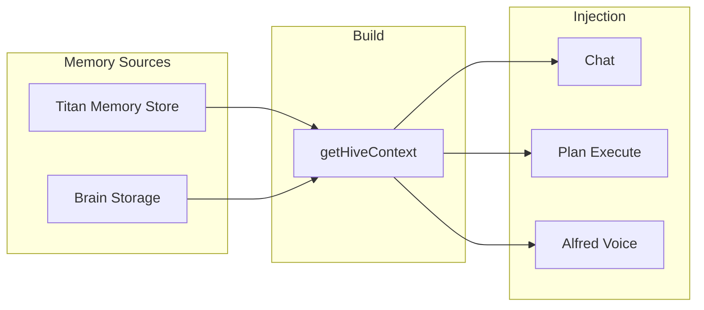

# Titan Hive Memory — Architecture & Comparison

Titan AI’s persistent memory system is designed to exceed alternatives like OpenClaw (2026) in structure, recall, and evolution. This document describes the architecture and how it compares.

---

## Design Goals

- **Persistent**: Survives sessions and restarts; shared across chat, Plan Mode, and Voice (Alfred).
- **Structured**: Layered (core facts, decisions, context, summaries, error patterns, skills) so the right information is prioritized.
- **Low hallucination**: Stored facts and skills are explicit; injection is bounded and labeled.
- **Strong recall**: Every model (chat, plan executor, Alfred) receives a unified “hive” context so behavior is consistent.
- **Evolving**: Auto-extraction, mistake ledger, usage tracking, and optional spaced repetition keep memory relevant.

---

## How Titan Beats OpenClaw (2026)

| Aspect | OpenClaw (2026) | Titan Hive Memory |
|--------|------------------|-------------------|
| **Storage** | Plain markdown files (MEMORY.md, daily logs, entity files) | Structured layers in Zustand + optional Supabase; workspace-scoped; no manual file editing |
| **Core file** | Single MEMORY.md (2k–3k words) loaded at startup | Multi-layer facts with importance/expiry; automatic serialization with token budget; always injected in order of relevance |
| **Daily / time-based** | memory/YYYY-MM-DD.md | Active context layer + conversation summaries with timestamps; optional daily compaction |
| **Tools** | memory_get (file/line read), memory_search (vector) | No file-based tools; unified `serialize(maxTokens)` + optional semantic search (hybrid-search); same API for all surfaces |
| **Vector search** | Optional (Mistral/Voyage), watches memory files | Optional (existing hybrid-search over Brain); can index Titan facts for semantic recall |
| **Who gets memory** | Agent only (when using tools) | Every LLM call: chat, plan execute, Alfred Voice; one “hive context” built client-side and injected |
| **Unified “brain”** | Separate files | Single Hive = Titan Memory (7 layers) + Brain (knowledge, skills, mistakes, strategy, ideas); one `getHiveContext()` for all |
| **Anti-hallucination** | Unspecified | Explicit sections (e.g. ANTI-PATTERNS, MISTAKE LEDGER); no mixing of memory with model output |
| **Evolution** | FSRS-6 spaced repetition, compaction, “memory flush” reminder | Importance + usageCount + lastUsedAt; cleanup by expiry; auto-extraction from conversations; mistake ledger; skills ledger |
| **Cross-model** | Single agent | Chat, Plan executor, Alfred, Phoenix, etc. all receive the same hive context so behavior is consistent (“hive mind”) |

---

## Architecture

### Titan Memory (7 layers)

1. **Core** — Identity, preferences, project context, tech stack.
2. **Decision** — Architecture choices, conventions.
3. **Context** — Current tasks, recent changes, WIP.
4. **Summary** — Compressed conversation history.
5. **Error pattern** — Anti-patterns, things to avoid.
6. **Skill** — How-to and techniques (with usage count).
7. **Mistake** — Recorded mistakes and fixes.

Persistence: `localStorage` (Zustand persist), keyed by workspace. Optional Supabase for cloud sync (Brain already uses it).

### Brain (Voice / Alfred)

Categories: knowledge, skill, idea, observation, mistake, finance, strategy, culture, research. Stored in Supabase with localStorage fallback. Serialized via `serializeBrainContext(maxChars)`.

### Hive context

- **Function**: `getHiveContext(maxChars)` (client-side) = `TitanMemory.serialize(n)` + `serializeBrainContext(m)` with shared token budget.
- **Used in**: Chat (system prompt), Plan Execute (systemContext from client), Alfred (personality + brain), Phoenix, and any future protocol that should “remember” like Titan.

---

## Retain / Recall / Reflect

- **Retain**: `addFact`, `addSummary`, `addSkill`, `recordMistake`, Brain `saveBrainEntry`, auto-extraction from conversations.
- **Recall**: `serialize(maxTokens)` (Titan), `serializeBrainContext(maxChars)` (Brain), `getHiveContext(maxChars)` (unified). Optional: semantic search via hybrid-search.
- **Reflect**: Mistake ledger, error-pattern layer, cleanup (expiry), usage tracking; future: periodic reflection prompts that update importance or merge facts.

---

## Usage

- **Chat**: Already uses `useTitanMemory.getState().serialize(1500)`; can switch to `getHiveContext(2000)` for unified hive.
- **Plan Execute**: Client builds `systemContext` with `getHiveContext(1500)` + file tree + project analysis; executor sees hive + workspace.
- **Alfred**: Already uses Titan Memory + Brain; can use `getHiveContext` for a single block.
- **New surfaces**: Import `getHiveContext` and prepend to system or context payload.

---

## References

- OpenClaw memory (2026): MEMORY.md, memory_get, memory_search, daily logs, vector search (Mistral/Voyage).
- Titan: [apps/web/src/stores/titan-memory.ts](../apps/web/src/stores/titan-memory.ts), [apps/web/src/lib/voice/brain-storage.ts](../apps/web/src/lib/voice/brain-storage.ts), [apps/web/src/lib/hive-memory.ts](../apps/web/src/lib/hive-memory.ts).
